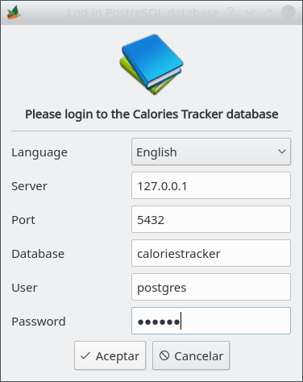
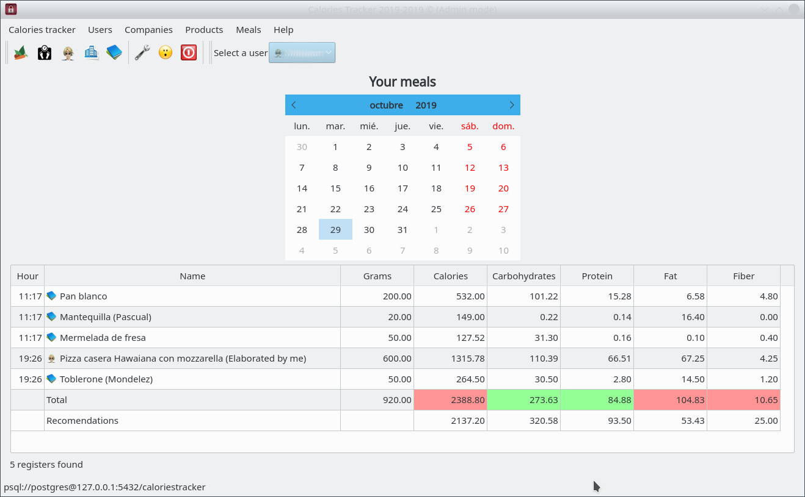
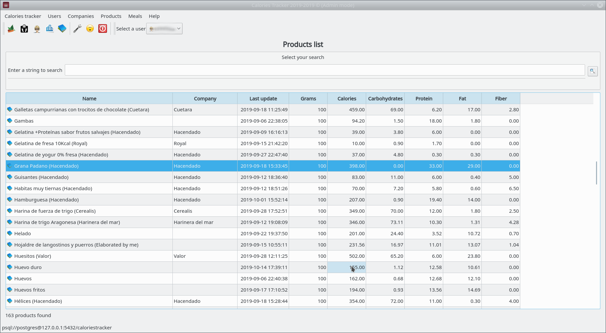
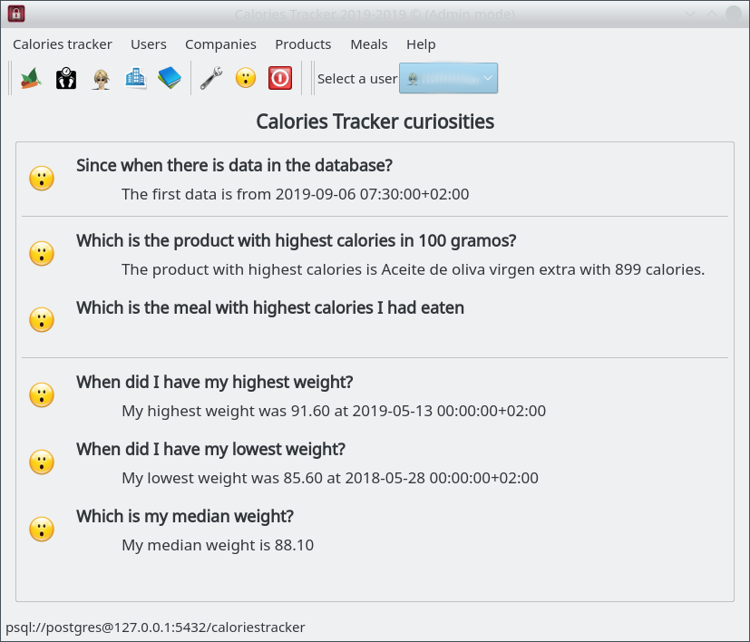
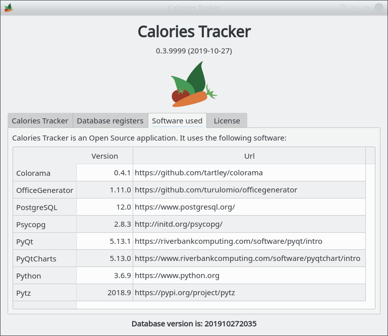

Links
=====
* [Project web page](https://turulomio.github.io/caloriestracker/)

* [User documentation](https://turulomio.github.io/caloriestracker/doc/CONTENTS.md)

* [API documentation](http://turulomio.users.sourceforge.net/doxygen/caloriestracker/)

* [Pypi web page](https://pypi.org/project/caloriestracker/)

Snapshots
=========
        
      

Install in Linux
================
If you use Gentoo, you can find the ebuild in https://github.com/turulomio/myportage/tree/master/app-office/caloriestracker

If you use another distribution, you nee to install PyQtChart and PyQtWebEngine manually. They aren't in Linux setup.py dependencies due to PyQt5 doesn't use standard setup tools. So for compatibility reasons with distributions like Gentoo, we use this additional step.

`pip install PyQtChart`

`pip install PyQtWebEngine`

`pip install caloriestracker`

Install in Windows
==================

You just download caloriestracker-X.X.X.exe and caloriestracker_init-X.X.X.exe and execute them. They are portable apps so they took a little more time to start, be patient.

Install in Windows with Python
==============================
Install python from https://www.python.org/downloads/ and don't forget to add python to the path during installation.

Open a CMD console

`pip install caloriestracker`

Now you have in the python scripts path `caloriestracker.exe` and `caloriestracker_init.exe`

If you want to create a Desktop shortcut, for this commands, you can write in console

`caloriestracker_shortcuts`

How to launch Calories Tracker
==============================
Calories Tracker uses PostgreSQL database as its backend. So you need to create a database and load its schema. Just type:

`caloriestracker_init`

Once database has been created, just log into caloriestracker after typing:

`caloriestracker`

Dependencies
============
* https://www.python.org/, as the main programming language.
* https://pypi.org/project/colorama/, to give console colors.
* http://initd.org/psycopg/, to access PostgreSQL database.
* https://pypi.org/project/PyQt5/, as the main library.
* https://pypi.org/project/pytz/, to work with timezones.
* https://pypi.org/project/officegenerator/, to work with LibreOffice and Microsoft Office documents.
* https://pypi.org/project/PyQtChart/, to work with charts.
* https://pypi.org/project/colorama/, to work with colors in console.

How to colaborate with Calories Tracker
=======================================

In Calories tracker you can add your own products and you can share them with us, if you wish with this [PROCEDURE](COLLABORATION.md)

Changelog
=========
0.5.0
  * Now you can find translated strings
  * Formats are now translated
  * Improved adding meals and products
  * Elaborated products show information in 100 graims
  * You can delete all meals from a selected day
  * Added meals I eat the most
  * Added more products

0.4.0
  * Calories Traker init executable is working again
  * Replaced QSpinwidgets to a personalized widget
  * Added format multipliers
  * Now you can report an issue from inside Calories Tracker
  * Improved products translations
  * Added more products

0.3.0
  * frmAbout user interface improved
  * Translations of hardcoded strings improved
  * Charts are improved
  * Added more curiosities
  * Added more products, companies and formats

0.2.0
  * Added formats, elaborated products
  * Updated to PyQt5-5.13.1
  * Improved spanish translation
  * Added users management
  * Improved contribution process
  * Added weight and height charts
  * Added more reused code

0.1.0
  * First version
